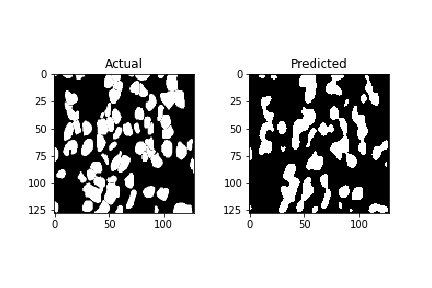
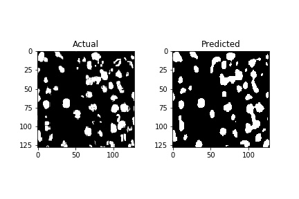

#Semantic Segmentation using UNet from scratch

## Data taken from Kaggle - https://www.kaggle.com/c/data-science-bowl-2018/data
## Aim was to find the nuclei in divergent images to advance medical discovery
### Outputs are shown below:

